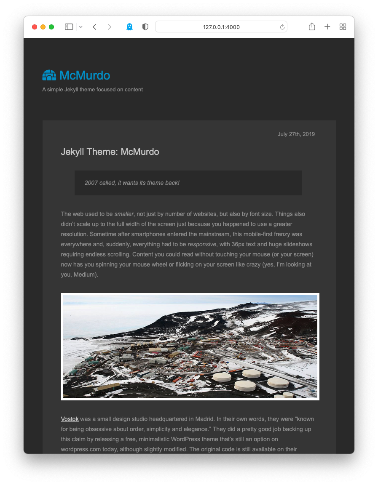

# McMurdo

2007 called, it wants its theme back!

There used to be a time when websites were not all fancy slideshows, 36px fonts and endless scrolling and content was king. McMurdo offers a rather classical blogging experience. The design is based on the [Vostok theme](https://code.google.com/archive/p/vostok-theme/downloads) for WordPress.

There are three color schemes available:
* black (default)
* white
* midnight 

You can change the theme by modifying the import in `assets/core.css`.

Here's a screenshot of the dark theme:

